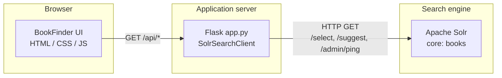

# Apache Solr — Indexing, Importing & Searching (Lab 13)

**BookFinder** is an end-to-end educational project for **Parallel and Distributed Computing (PDC)**. It demonstrates a realistic search stack: **Apache Solr 9.x** as the search engine, a **Python Flask** API as a thin integration layer, and a **vanilla HTML/CSS/JavaScript** web client. Together they cover schema design, bulk indexing, rich queries (full-text, filters, facets, highlighting, autocomplete), and a usable product-style UI.

---

## Table of contents

1. [What this project teaches](#1-what-this-project-teaches)
2. [Architecture](#2-architecture)
3. [Technology stack](#3-technology-stack)
4. [Repository layout](#4-repository-layout)
5. [Prerequisites](#5-prerequisites)
6. [Apache Solr setup](#6-apache-solr-setup)
7. [Schema, analyzers, and configuration](#7-schema-analyzers-and-configuration)
8. [Dataset](#8-dataset)
9. [Indexing the data](#9-indexing-the-data)
10. [Flask backend](#10-flask-backend)
11. [BookFinder web UI](#11-bookfinder-web-ui)
12. [Environment variables](#12-environment-variables)
13. [Scripts reference](#13-scripts-reference)
14. [Examples and screenshots](#14-examples-and-screenshots)
15. [Troubleshooting](#15-troubleshooting)
16. [License](#16-license)

---

## 1. What this project teaches

| Topic | How it appears in this repo |
| --- | --- |
| **Core / collection lifecycle** | Create a `books` core, apply schema via Schema API, reload after resource updates. |
| **Field types & analyzers** | English text with stemming and stopwords; edge n-grams for autocomplete; point types for sort/facet/range. |
| **Synonyms & stopwords** | `solr-config/synonyms.txt` and `stopwords.txt` installed into the core (or ZooKeeper in SolrCloud). |
| **copyField** | Route title, author, description, genres, tags into `_text_`; copy title to `title_str` and `title_ac`. |
| **Indexing** | JSON bulk update (`books.json`) and optional CSV path with multivalued `;` separators. |
| **Querying** | `edismax` with boosts, `fq` filters, facets, range facets, highlighting, sorting, pagination. |
| **Suggester** | Primary autocomplete via `/suggest`; resilient **fallback** prefix query on `title_ac` if the handler is missing. |
| **Integration layer** | Flask exposes REST JSON consumed by a static SPA; CORS enabled for split-origin dev if needed. |
| **UX** | Live search, facets, mobile drawer for filters, book detail modal, health indicator, light/dark themes. |

---

## 2. Architecture

Solr holds the authoritative **inverted index**. The Flask app **does not** duplicate business rules in SQL; it translates HTTP query parameters into Solr HTTP parameters and returns JSON. The browser UI calls only Flask (same origin when served by Flask), keeping keys and Solr details off the client except through the API.



**Data flow (search):**

1. User types a query or changes filters in the UI.
2. UI debounces and calls `GET /api/search` (and related endpoints) on Flask.
3. `SolrSearchClient` builds Solr parameters (`defType=edismax`, `qf`, `pf`, `fq`, facets, `hl`, etc.).
4. Solr returns JSON; Flask reshapes minimally (e.g. facet normalization) and responds.
5. UI renders cards, facets, pagination, and highlights.

---

## 3. Technology stack

| Layer | Technology | Version notes |
| --- | --- | --- |
| Search | **Apache Solr** | 9.x recommended; scripts use Schema API and `solr` CLI patterns compatible with Solr 9–10 (standalone user-managed mode where noted). |
| API | **Python**, **Flask**, **flask-cors**, **requests** | See `backend/requirements.txt`. |
| Optional indexing | **pysolr** | Used by `scripts/index_data.py` for programmatic bulk add. |
| UI | **No bundler** | Semantic HTML5, CSS (custom properties, grid, flex, media queries), ES modules–free vanilla JS. |
| Dataset | **JSON / CSV** | Generated or hand-maintained under `data/`. |

---

## 4. Repository layout

```
Apache_solr_for_Indexing_Importing_Searching/
├── README.md                 ← This file (project overview)
├── .gitignore
│
├── data/                     # Book catalog and dataset documentation
│   ├── README.md             # Field-by-field schema of the dataset files
│   ├── books.json            # Primary bulk index source (JSON array)
│   └── books.csv             # Alternate CSV path (;-separated multivalues)
│
├── solr-config/              # Text resources & reference XML for Solr
│   ├── README.md             # Field types, copyFields, merge notes
│   ├── managed-schema.xml    # Reference managed schema (merge manually or diff vs Schema API)
│   ├── solrconfig-snippets.xml
│   ├── synonyms.txt
│   └── stopwords.txt
│
├── scripts/                  # Automation (Bash on Unix, .bat on Windows where provided)
│   ├── setup_solr.sh / .bat              # Start Solr, create core, apply schema (convenience)
│   ├── setup_solrcloud.sh / .bat       # SolrCloud-oriented setup helpers
│   ├── apply_schema.sh / .bat            # Schema API: field types, fields, copyFields
│   ├── install_resources.sh / .bat       # Push synonyms/stopwords; standalone or ZK
│   ├── index_data.sh / .bat / index_data.py   # Bulk index JSON (or CSV via env)
│   ├── generate_dataset.py             # Regenerate books.json / books.csv
│   └── sample_queries.sh                 # Example curl queries against Solr
│
├── backend/                  # Flask service
│   ├── app.py                # Routes: /api/* and static frontend
│   ├── config.py             # Environment-driven configuration
│   ├── search_client.py      # Solr HTTP client (requests, not pysolr)
│   └── requirements.txt      # Flask stack + requests + pysolr + python-docx
│
├── frontend/                 # BookFinder static site
│   ├── index.html
│   ├── styles.css            # Layout, themes, modal, mobile drawer
│   ├── app.js                # Search, facets, pagination, modal, drawer
│   └── README.md             # UI-focused notes
│
├── examples/                 # Solr query cookbook & lab observations
│   ├── queries.md
│   └── observations.md
│
└── ScreenShots/              # UI / Solr UI captures for reports (see ScreenShots/README.md)
```

---

## 5. Prerequisites

### Required

- **Python 3.9+** (3.11+ tested in development; match your course VM if applicable).
- **Apache Solr 9.x** installed on the machine and the `solr` command on your `PATH` (or set `SOLR_HOME` per Solr docs).
- **curl** and **python3** (used by shell scripts for Schema API and pretty-printing JSON).
- A **network** connection only for optional `pip install` (PyPI); Solr and Flask run locally.

### Optional

- **Git** for version control.
- **Opera / Chrome / Firefox / Safari** for testing the UI (mobile emulation recommended for the facet drawer).

Solr itself is **not** vendored inside this repository—you install it via OS package manager, official tarball, or Windows zip from [solr.apache.org](https://solr.apache.org/downloads.html).

---

## 6. Apache Solr setup

### 6.1 Quick path (recommended)

From the repository root:

```bash
bash scripts/setup_solr.sh
```

This script (see `scripts/setup_solr.sh` for details):

1. Verifies `solr` is on `PATH`.
2. Starts Solr on `SOLR_PORT` (default **8983**) if not already up. On Solr 10+, it may use **`solr start --user-managed`** for traditional core mode—check the script comments on your Solr version.
3. Creates the **`books`** core if missing.
4. Invokes **`scripts/apply_schema.sh`** to register field types and fields.

Then install text resources and index:

```bash
bash scripts/install_resources.sh   # synonyms + stopwords into core or ZK
bash scripts/index_data.sh          # default: JSON from data/books.json
```

Windows users can run the matching **`.bat`** files in `scripts/`.

### 6.2 Manual path

```bash
solr start -p 8983
solr create -c books
bash scripts/apply_schema.sh
bash scripts/install_resources.sh
bash scripts/index_data.sh
```

### 6.3 SolrCloud

For multi-node / ZooKeeper deployments, use **`setup_solrcloud.sh`** and **`install_resources.sh`** (cloud branch pushes `synonyms.txt` / `stopwords.txt` into ZK and reloads the collection). Set **`ZK_HOST`** if your ensemble is not `localhost:9983`.

---

## 7. Schema, analyzers, and configuration

### 7.1 `solr-config/` (source of truth for text resources)

| Artifact | Role |
| --- | --- |
| `synonyms.txt` | Query-time synonym expansion for `text_en` (e.g. common tech abbreviations). |
| `stopwords.txt` | English stopword list for indexing and querying. |
| `managed-schema.xml` | **Reference** schema: fields, types, `copyField` directives—useful for diffing against what the Schema API created. |
| `solrconfig-snippets.xml` | Snippets to merge into a core’s `solrconfig.xml` for `/select`, `/suggest`, spellchecker, etc. |

### 7.2 Field types (created by `apply_schema.sh`)

- **`text_en`** — Standard tokenizer, lowercase, possessive filter, Porter stemmer, stopwords. Synonym graph at **query** time keeps the index smaller.
- **`text_suggest`** — Edge n-grams (min 2, max 20) for prefix autocomplete on `title_ac`.

### 7.3 Important fields (document schema)

Aligned with `data/README.md`:

| Field | Solr type (concept) | Usage |
| --- | --- | --- |
| `id` | string | Unique key (`book_0001`, …). |
| `title` | text_en | Full-text + highlighting. |
| `title_str` | string | Sortable title (via copyField). |
| `title_ac` | text_suggest | Autocomplete / prefix fallback. |
| `author` | text_en | Full-text search. |
| `author_str` | string | Faceting / display. |
| `description` | text_en | Snippets + highlighting. |
| `genres` | strings | Multivalued facet. |
| `tags` | strings | Multivalued facet. |
| `language`, `publisher` | string | Facets / filters. |
| `year`, `pages`, `stock_count` | pint | Ranges, sorts, decade facet. |
| `rating`, `price` | pfloat | Sorts, range filters. |
| `in_stock` | boolean | Filter. |
| `isbn` | string | Detail view. |
| `pub_date` | pdate | Sort / range. |
| `_text_` | text_en | Catch-all (copyField targets). |

---

## 8. Dataset

- **`data/books.json`** — JSON **array** of objects; preferred for `index_data.sh` with `FORMAT=json` (default).
- **`data/books.csv`** — Flat file; multivalued `genres` and `tags` use **`;`** between values when using CSV update.

Regeneration (deterministic expanded catalog):

```bash
python scripts/generate_dataset.py
```

See `data/README.md` for the full column list and regeneration notes (~250 documents: curated seed plus synthetic combinations for facet/stat demos).

---

## 9. Indexing the data

### Option A — Shell + curl (`scripts/index_data.sh`)

```bash
bash scripts/index_data.sh
```

Environment overrides:

| Variable | Default | Meaning |
| --- | --- | --- |
| `SOLR_PORT` | `8983` | Solr port. |
| `CORE_NAME` | `books` | Core or collection name. |
| `FORMAT` | `json` | `json` → `books.json`; `csv` → `books.csv`. |

### Option B — Python + pysolr (`scripts/index_data.py`)

```bash
pip install -r backend/requirements.txt
python scripts/index_data.py
```

Uses **`SOLR_HOST`**, **`SOLR_PORT`**, **`CORE_NAME`** (defaults: `localhost`, `8983`, `books`). Posts **`data/books.json`** only.

### Verify document count

```bash
curl -s "http://localhost:8983/solr/books/select?q=*:*&rows=0" | python3 -m json.tool
```

Expect **`numFound`** to match your dataset size (~250 after generation).

---

## 10. Flask backend

### 10.1 Design

- **`app.py`** — HTTP routing, query parameter parsing, static file serving for the frontend from the same origin.
- **`search_client.py`** — All Solr HTTP calls via **`requests`**, parameterized URLs, `_escape_solr()` for IDs and user fragments used inside Solr query strings.
- **`config.py`** — Frozen dataclass loaded from **environment variables** (see [§12](#12-environment-variables)).

### 10.2 HTTP API

| Method & path | Purpose |
| --- | --- |
| `GET /api/health` | Solr admin ping + `*:*` row count; `503` if Solr unreachable. |
| `GET /api/search` | Main search: full-text, facets, filters, highlight, sort, pagination. |
| `GET /api/suggest?q=` | Autocomplete; Solr Suggester first, **`title_ac` prefix** fallback. |
| `GET /api/facets` | Facet metadata only (`q=*:*`, `rows=0`) for sidebar bootstrap. |
| `GET /api/book/<id>` | Single document by `id`. |
| `GET /` | Serves `frontend/index.html`. |
| `GET /<filename>` | Serves other static files from `frontend/` if present (e.g. `styles.css`, `app.js`). |

### 10.3 `GET /api/search` — query parameters

| Parameter | Description |
| --- | --- |
| `q` | User query; default treated as empty → `*:*` in client. |
| `page`, `rows` | 1-based page and page size (capped by `PAGE_SIZE_MAX`). |
| `sort` | Solr `sort` string (e.g. `score desc`, `rating desc`, `year asc`, `title_str asc`). |
| `genre`, `language`, `publisher`, `tag` | Repeatable; each becomes an `fq` on the mapped field. |
| `in_stock` | `1` / `true` / `yes` → filter in-stock. |
| `year_min`, `year_max` | Inclusive year range `fq`. |
| `rating_min` | Minimum rating `fq`. |

Response highlights include **`documents`**, **`facets`** (normalized), **`total`**, timing metadata, and Solr **`QTime`**.

### 10.4 Run the backend

```bash
cd /path/to/Apache_solr_for_Indexing_Importing_Searching
python3 -m venv .venv
source .venv/bin/activate          # Windows: .venv\Scripts\activate
pip install -r backend/requirements.txt
python backend/app.py
```

Default: **API** at `http://0.0.0.0:5000`, Solr at `http://localhost:8983/solr/books`. Open **`http://localhost:5000/`** in a browser—Flask serves the UI and API on the **same port** (recommended).

Custom port:

```bash
FLASK_PORT=5001 python backend/app.py
# Then open http://localhost:5001/
```

### 10.5 Python dependencies (`backend/requirements.txt`)

| Package | Role in this project |
| --- | --- |
| `Flask` | HTTP server and routing. |
| `flask-cors` | CORS headers if you split UI and API origins during development. |
| `requests` | Solr HTTP client inside `SolrSearchClient`. |
| `pysolr` | Optional bulk indexer in `scripts/index_data.py` only. |
| `python-docx` | Reserved for optional lab-report tooling (e.g. Markdown → Word); core search does not require it at runtime. |

---

## 11. BookFinder web UI

Located in **`frontend/`**. No build step: Flask serves these files in production-style demos; alternatively `python -m http.server --directory frontend` works **only** if you also run Flask elsewhere and accept CORS / API base URL behavior (the app prefers **same-origin** HTTP for API calls).

### 11.1 Features

- **Live search** with debounced requests.
- **Autocomplete** dropdown from `/api/suggest`.
- **Facet sidebar**: genres, language, publisher, tags, year buckets; multi-select facets combine with AND-style `fq` logic on the server.
- **Quick filters**: in-stock, minimum rating slider, year min/max.
- **Sort** dropdown (relevance, rating, year, price, title).
- **Highlighted** titles and descriptions (`<mark>`).
- **Pagination** with ellipsis for many pages.
- **Book detail modal** loaded from `/api/book/<id>`.
- **Health pill** polling `/api/health` every 30 seconds.
- **Light / dark** styling via `prefers-color-scheme`.
- **Responsive layout**: CSS grid with fluid min column widths; **≤960px** shows book results first and moves filters into a **slide-out drawer** opened with **“Filters & facets”**; backdrop tap, **Done**, or **Escape** closes it.
- **Viewport**: `meta name="viewport"` for mobile; safe-area padding on header/modal where applicable.

### 11.2 API base URL logic (`frontend/app.js`)

- On **`http:`** or **`https:`** pages, API calls use **relative URLs** (same host and port as the page)—required when Flask runs on a non-default port.
- On **`file:`** opens, the UI falls back to **`http://localhost:5000`** for API calls.

---

## 12. Environment variables

### Flask / Solr client (`backend/config.py`)

| Variable | Default | Description |
| --- | --- | --- |
| `SOLR_HOST` | `localhost` | Solr hostname. |
| `SOLR_PORT` | `8983` | Solr port. |
| `SOLR_CORE` | `books` | Core or collection name. |
| `FLASK_HOST` | `0.0.0.0` | Bind address. |
| `FLASK_PORT` | `5000` | Listen port for Flask. |
| `FLASK_DEBUG` | `1` | `1` enables Flask debug/reloader; set `0` for stricter runs. |
| `SOLR_REQUEST_TIMEOUT` | `10.0` | Per-request HTTP timeout (seconds). |
| `PAGE_SIZE_DEFAULT` | `12` | Default `rows` per page. |
| `PAGE_SIZE_MAX` | `100` | Server-side cap for `rows`. |

### Shell scripts (`index_data.sh`, `apply_schema.sh`, etc.)

Common names: **`SOLR_PORT`**, **`CORE_NAME`**, **`FORMAT`** (index script), **`ZK_HOST`** (install_resources cloud mode). Defaults align with local Solr.

---

## 13. Scripts reference

| Script | Platform | Purpose |
| --- | --- | --- |
| `setup_solr.sh` / `.bat` | Unix / Win | Start Solr, create `books` core, run `apply_schema.sh`. |
| `setup_solrcloud.sh` / `.bat` | Unix / Win | SolrCloud-oriented bootstrap (see script headers). |
| `apply_schema.sh` / `.bat` | Unix / Win | Idempotent Schema API calls for types, fields, copyFields. |
| `install_resources.sh` / `.bat` | Unix / Win | Copy or ZK-push `synonyms.txt` + `stopwords.txt`, reload core/collection. |
| `index_data.sh` / `.bat` | Unix / Win | POST `books.json` or `books.csv` to Solr `/update`. |
| `index_data.py` | Cross | Bulk add JSON via pysolr + commit. |
| `generate_dataset.py` | Cross | Write `data/books.json` and `data/books.csv`. |
| `sample_queries.sh` | Unix | Demonstration curls against `/select` and related handlers. |

---

## 14. Examples and screenshots

- **`examples/queries.md`** — Large set of copy-paste Solr query examples (filters, facets, highlighting, etc.).
- **`examples/observations.md`** — Qualitative notes on relevance, latency, and tuning.
- **`ScreenShots/`** — PNG captures for lab reports; see **`ScreenShots/README.md`** for naming conventions.

If your course also ships **`docs/`** (lab report markdown, Word export, step-by-step runbook), keep them alongside this tree or link them from your submission portal—the core technical content is summarized here and under `data/README.md` and `solr-config/README.md`.

---

## 15. Troubleshooting

| Symptom | Things to check |
| --- | --- |
| **`/api/health` fails** | Is Solr up? Correct `SOLR_PORT` / `SOLR_CORE`? Firewall? |
| **Empty search results** | Was `index_data` run? `select?q=*:*&rows=0` shows `numFound`? |
| **Autocomplete always empty** | `/suggest` handler may be missing—client falls back to `title_ac` prefix; ensure `title_ac` exists and has data. |
| **UI calls wrong port** | Open the UI at the **same origin** as Flask (e.g. both `:5001`). Hard-refresh after changing `app.js` / `styles.css` (cache-busting query on `index.html` links). |
| **Schema API errors** | Core must exist first; re-run `apply_schema.sh` after a clean core; check Solr logs. |
| **CSV index garbled multivalues** | Use `;` only inside `genres` / `tags` columns as documented in `index_data.sh`. |
| **Mobile drawer / modal quirks** | Use an evergreen browser; ensure `styles.css` version in `index.html` matches latest (sidebar `position` is breakpoint-scoped so it is not overridden by desktop rules). |

---

## 16. License

This repository is provided for **educational purposes** as part of the **PDC** curriculum at **NUST**. Apache Solr and other upstream projects retain their respective licenses.

---

## Further reading

- [Apache Solr Reference Guide](https://solr.apache.org/guide/solr/latest/index.html)
- [Solr Schema API](https://solr.apache.org/guide/solr/latest/indexing-guide/schema-api.html)
- [Extended DisMax Query Parser](https://solr.apache.org/guide/solr/latest/query-guide/edismax-query-parser.html)

